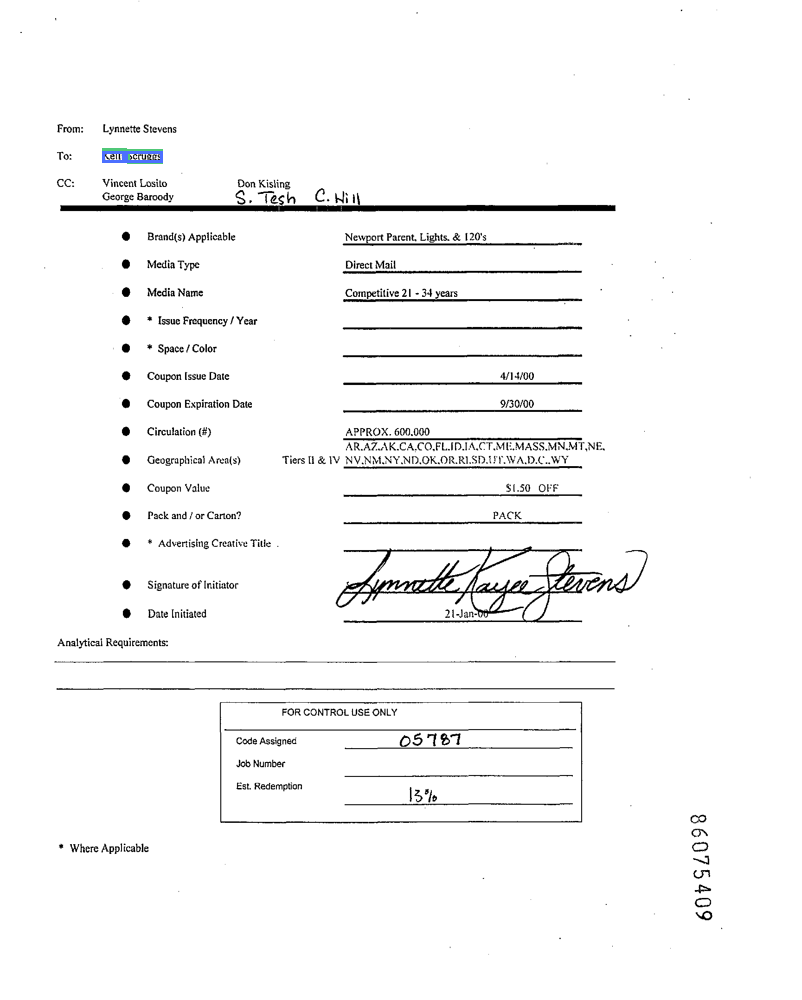
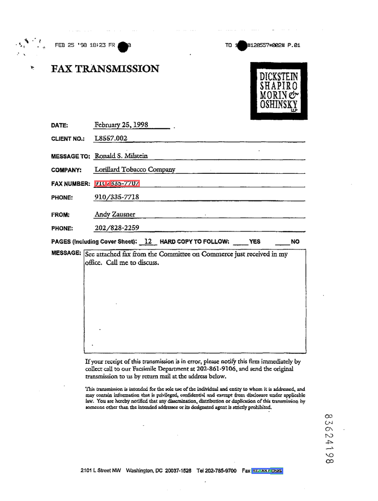
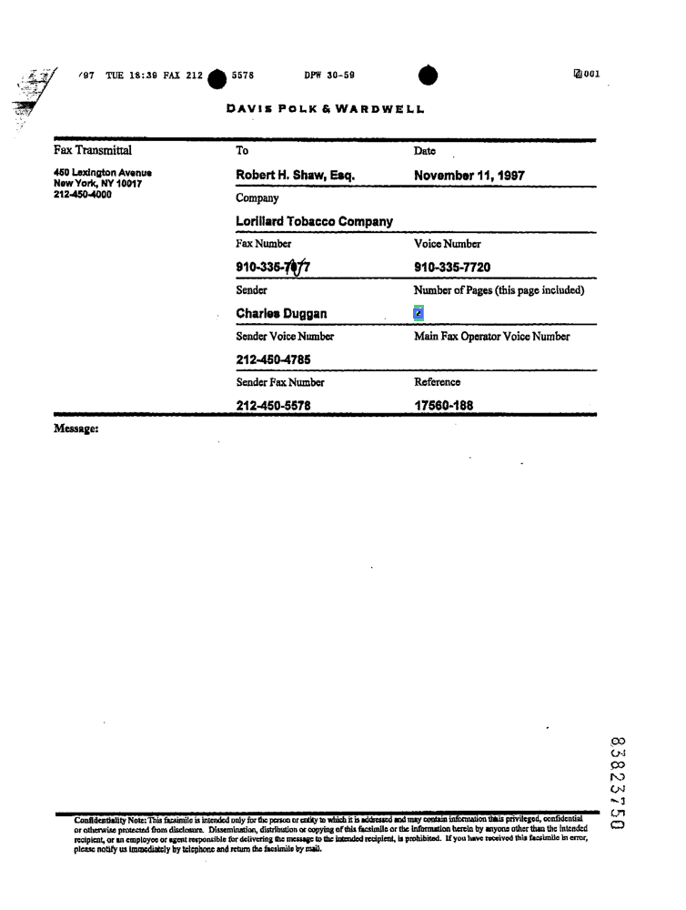
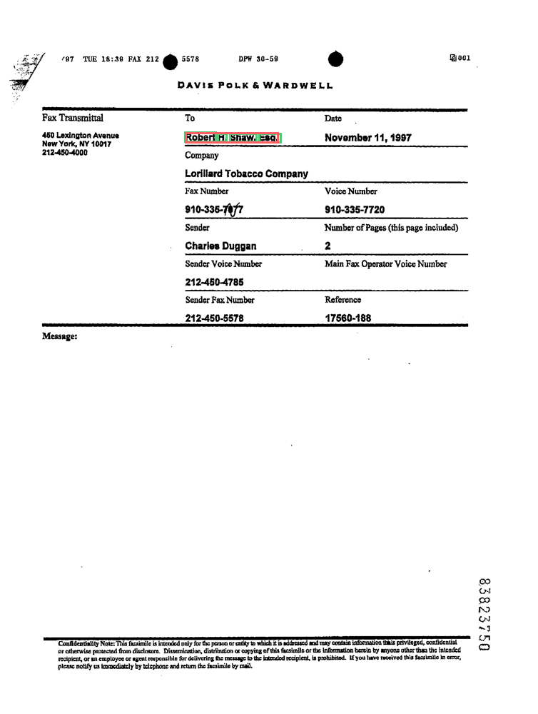
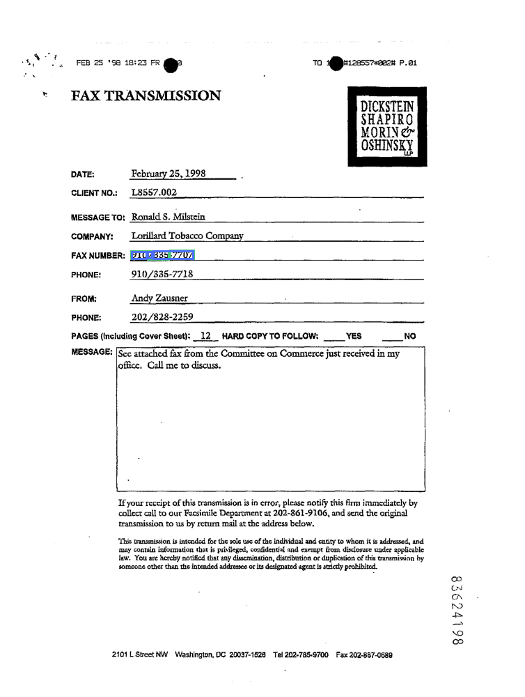
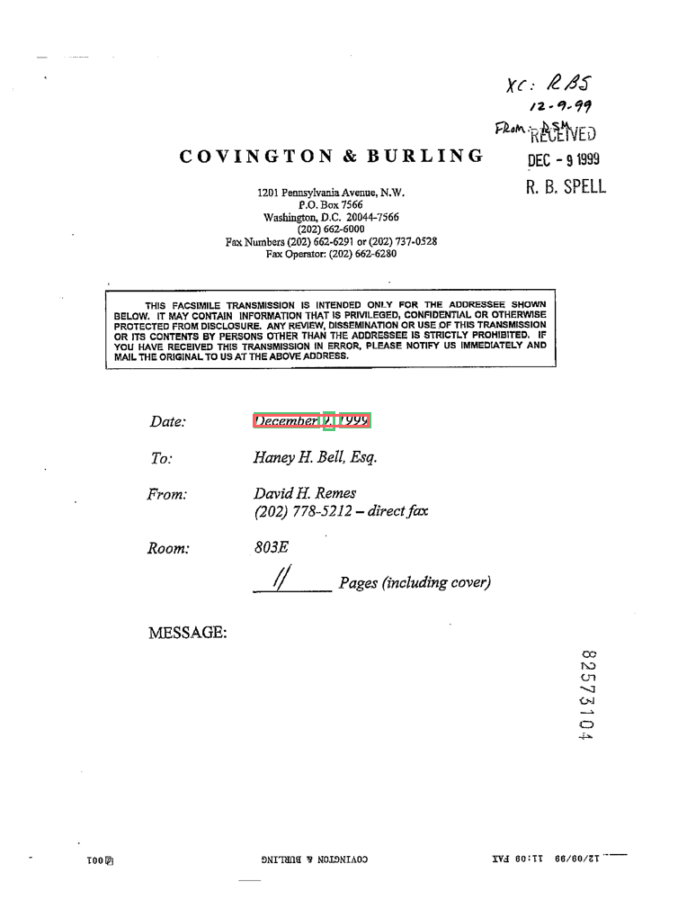
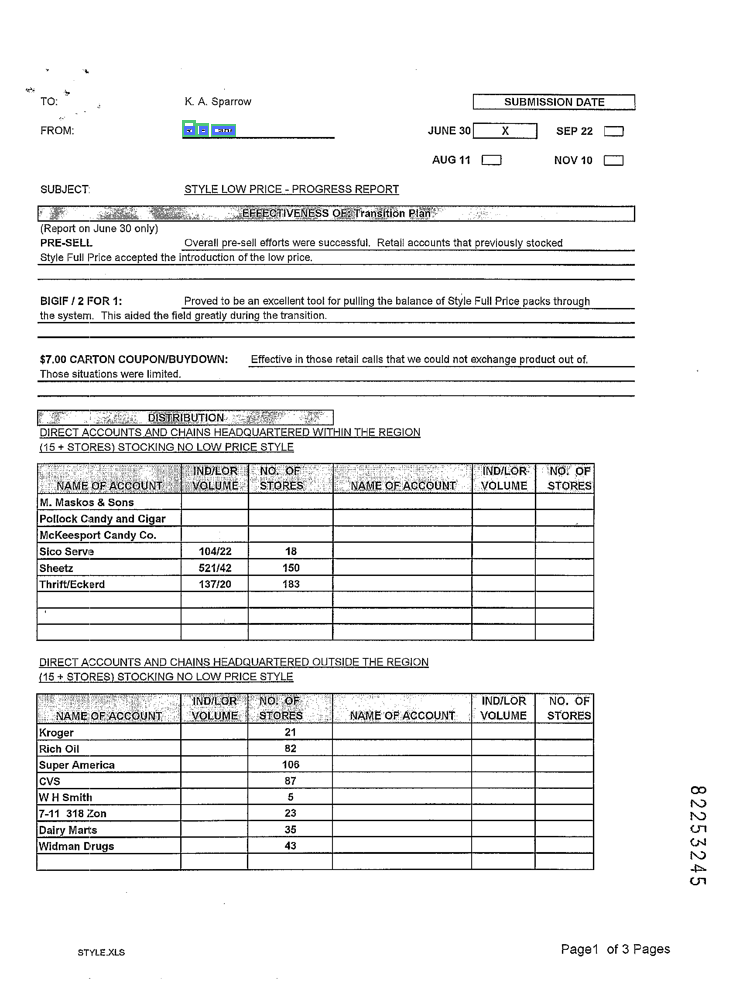
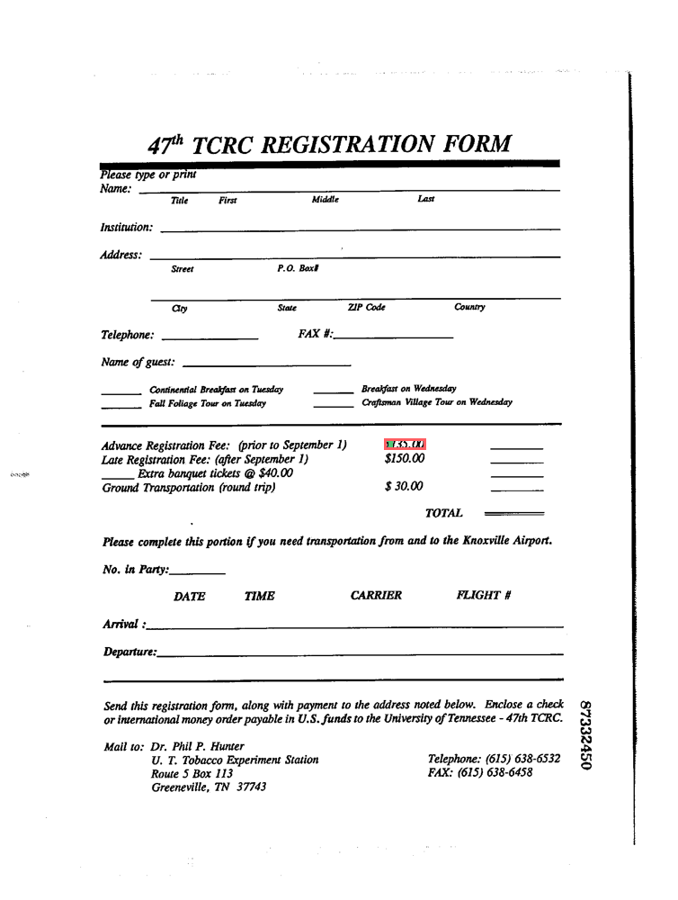
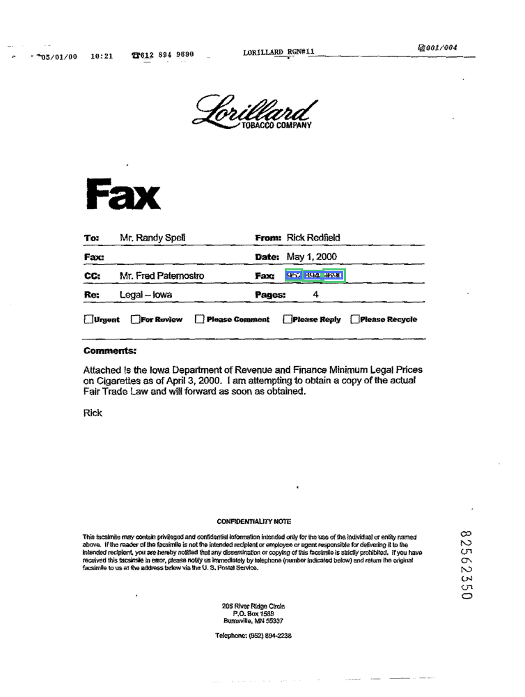
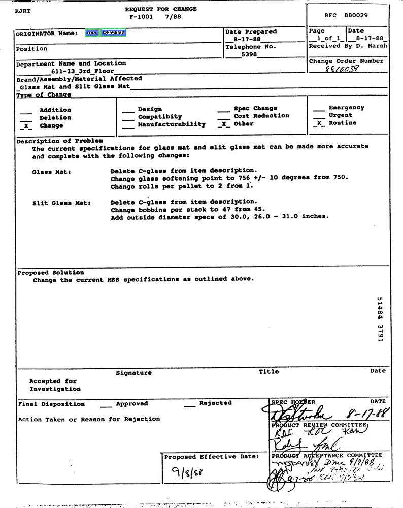

# FUNSD overlay gallery (sample run)

Legend:
- GT (green outline, per-word boxes)
- Raw + Fuzzy (red outline, merged/rails boxes)
- Indexed is hidden in these images (values shown below).

These overlays are generated from the 20-sample FUNSD evaluation run:
`reports/funsd/run_20260202_203009.json` (non-excluded examples only).

## 86075409_5410_q1

Field label: `To:`
GT status: `funsd_gt` (source: `dataset`)

| Source | Value |
| --- | --- |
| GT | `Kelli Scruggs` |
| Raw + Fuzzy | `Kelli Scruggs` |
| Indexed (hidden) | `Kelli Scruggs` |

| Method | Overlap | Precision | Recall | Strict IoU |
| --- | --- | --- | --- | --- |
| Raw + Fuzzy | 1.00 | 1.00 | 1.00 | 1.00 |
| Indexed (hidden) | 1.00 | 1.00 | 1.00 | 1.00 |

Hand-review notes: -

## 86236474_6476_q0

Field label: `TO:`
GT status: `funsd_gt` (source: `dataset`)

| Source | Value |
| --- | --- |
| GT | `Mrs. K. A. Sparrow` |
| Raw + Fuzzy | `Mrs. K.A. Sparrow` |
| Indexed (hidden) | `Mrs. K.A. Sparrow` |

| Method | Overlap | Precision | Recall | Strict IoU |
| --- | --- | --- | --- | --- |
| Raw + Fuzzy | 1.00 | 1.00 | 1.00 | 0.17 |
| Indexed (hidden) | 1.00 | 1.00 | 1.00 | 0.17 |

Hand-review notes: -

## 83624198_q13

Field label: `Fax`
GT status: `funsd_gt` (source: `dataset`)

| Source | Value |
| --- | --- |
| GT | `202 -887 -0589` |
| Raw + Fuzzy | `910 / 335-7707` |
| Indexed (hidden) | `202-887-0689` |

| Method | Overlap | Precision | Recall | Strict IoU |
| --- | --- | --- | --- | --- |
| Raw + Fuzzy | 0.00 | 0.00 | 0.00 | 0.00 |
| Indexed (hidden) | 1.00 | 1.00 | 1.00 | 0.00 |

Hand-review notes: -

## 83823750_q24

Field label: `Number of Pages (this page included)`
GT status: `funsd_gt` (source: `dataset`)

| Source | Value |
| --- | --- |
| GT | `2` |
| Raw + Fuzzy | `2` |
| Indexed (hidden) | `2` |

| Method | Overlap | Precision | Recall | Strict IoU |
| --- | --- | --- | --- | --- |
| Raw + Fuzzy | 1.00 | 1.00 | 1.00 | 1.00 |
| Indexed (hidden) | 1.00 | 1.00 | 1.00 | 1.00 |

Hand-review notes: -

## 83443897_q7

Field label: `NO`
GT status: `funsd_gt` (source: `dataset`)

| Source | Value |
| --- | --- |
| GT | `X` |
| Raw + Fuzzy | `✗` |
| Indexed (hidden) | `L8557.002` |

| Method | Overlap | Precision | Recall | Strict IoU |
| --- | --- | --- | --- | --- |
| Raw + Fuzzy | 1.00 | 1.00 | 1.00 | 1.00 |
| Indexed (hidden) | 0.00 | 0.00 | 0.00 | 0.00 |

Hand-review notes: -

## 83823750_q3

Field label: `To`
GT status: `funsd_gt` (source: `dataset`)

| Source | Value |
| --- | --- |
| GT | `Robert H. Shaw, Esq.` |
| Raw + Fuzzy | `Robert H. Shaw , Esq .` |
| Indexed (hidden) | `Robert H. Shaw , Esq .` |

| Method | Overlap | Precision | Recall | Strict IoU |
| --- | --- | --- | --- | --- |
| Raw + Fuzzy | 0.80 | 0.67 | 1.00 | 0.67 |
| Indexed (hidden) | 0.80 | 0.67 | 1.00 | 0.67 |

Hand-review notes: -

## 83624198_q25

Field label: `FAX NUMBER:`
GT status: `funsd_gt` (source: `dataset`)

| Source | Value |
| --- | --- |
| GT | `910/ 335- 7707` |
| Raw + Fuzzy | `910 / 335-7707` |
| Indexed (hidden) | `910 / 335-7707` |

| Method | Overlap | Precision | Recall | Strict IoU |
| --- | --- | --- | --- | --- |
| Raw + Fuzzy | 1.00 | 1.00 | 1.00 | 0.50 |
| Indexed (hidden) | 1.00 | 1.00 | 1.00 | 0.50 |

Hand-review notes: -

## 82573104_q2

Field label: `Date:`
GT status: `funsd_gt` (source: `dataset`)

| Source | Value |
| --- | --- |
| GT | `December 9, 1999` |
| Raw + Fuzzy | `December 9 , 1999` |
| Indexed (hidden) | `December 9 , 1999` |

| Method | Overlap | Precision | Recall | Strict IoU |
| --- | --- | --- | --- | --- |
| Raw + Fuzzy | 1.00 | 1.00 | 1.00 | 0.40 |
| Indexed (hidden) | 1.00 | 1.00 | 1.00 | 0.40 |

Hand-review notes: -

## 82253245_3247_q1

Field label: `FROM:`
GT status: `funsd_gt` (source: `dataset`)

| Source | Value |
| --- | --- |
| GT | `R. E. Lane` |
| Raw + Fuzzy | `R. E. Lane` |
| Indexed (hidden) | `R. E. Lane` |

| Method | Overlap | Precision | Recall | Strict IoU |
| --- | --- | --- | --- | --- |
| Raw + Fuzzy | 1.00 | 1.00 | 1.00 | 0.20 |
| Indexed (hidden) | 1.00 | 1.00 | 1.00 | 0.20 |

Hand-review notes: -

## 91814768_91814769_q35

Field label: `4. Question No.`
GT status: `manual_gt` (source: `raw`)

| Source | Value |
| --- | --- |
| GT | `1` |
| Raw + Fuzzy | `1` |
| Indexed (hidden) | `1` |

| Method | Overlap | Precision | Recall | Strict IoU |
| --- | --- | --- | --- | --- |
| Raw + Fuzzy | 1.00 | 1.00 | 1.00 | 1.00 |
| Indexed (hidden) | 1.00 | 1.00 | 1.00 | 1.00 |

Hand-review notes: "Question No" is a separate field from "relating to"

## 86236474_6476_q14

Field label: `DIRECT ACCOUNT CHAINS:`
GT status: `funsd_gt` (source: `dataset`)

| Source | Value |
| --- | --- |
| GT | `Eagle Foods is the only Void.` |
| Raw + Fuzzy | `Eagle Foods is the only Void .` |
| Indexed (hidden) | `Eagle Foods` |

| Method | Overlap | Precision | Recall | Strict IoU |
| --- | --- | --- | --- | --- |
| Raw + Fuzzy | 0.92 | 0.86 | 1.00 | 0.86 |
| Indexed (hidden) | 0.50 | 1.00 | 0.33 | 0.33 |

Hand-review notes: -

## 87332450_q31

Field label: `Advance Registration Fee:`
GT status: `manual_gt` (source: `raw`)

| Source | Value |
| --- | --- |
| GT | `$ 135.00` |
| Raw + Fuzzy | `$ 135.00` |
| Indexed (hidden) | `$135.00` |

| Method | Overlap | Precision | Recall | Strict IoU |
| --- | --- | --- | --- | --- |
| Raw + Fuzzy | 1.00 | 1.00 | 1.00 | 1.00 |
| Indexed (hidden) | 1.00 | 1.00 | 1.00 | 1.00 |

Hand-review notes: GT missing "."

## 82562350_q10

Field label: `Fax:`
GT status: `funsd_gt` (source: `dataset`)

| Source | Value |
| --- | --- |
| GT | `952 894- 9690` |
| Raw + Fuzzy | `952 894-9690` |
| Indexed (hidden) | `952 894-9690` |

| Method | Overlap | Precision | Recall | Strict IoU |
| --- | --- | --- | --- | --- |
| Raw + Fuzzy | 1.00 | 1.00 | 1.00 | 0.25 |
| Indexed (hidden) | 1.00 | 1.00 | 1.00 | 0.25 |

Hand-review notes: -

## 82200067_0069_q11

Field label: `REGION:`
GT status: `funsd_gt` (source: `dataset`)

| Source | Value |
| --- | --- |
| GT | `(ONLY IF PARTIAL REGION CONTINUE WITH DIVISION (S) SCOPE)` |
| Raw + Fuzzy | `(ONLY IF PARTIAL REGION CONTINUE WITH DIVISION (SCOPE))` |
| Indexed (hidden) | `ERROR: LLM returned no citations.` |

| Method | Overlap | Precision | Recall | Strict IoU |
| --- | --- | --- | --- | --- |
| Raw + Fuzzy | 0.82 | 0.69 | 1.00 | 0.57 |
| Indexed (hidden) | 0.00 | 0.00 | 0.00 | 0.00 |

Hand-review notes: -

## 87528321_q65

Field label: `ORIGINATOR Name:`
GT status: `funsd_gt` (source: `dataset`)

| Source | Value |
| --- | --- |
| GT | `Dan Straka` |
| Raw + Fuzzy | `Dan Straka` |
| Indexed (hidden) | `Dan Straka` |

| Method | Overlap | Precision | Recall | Strict IoU |
| --- | --- | --- | --- | --- |
| Raw + Fuzzy | 1.00 | 1.00 | 1.00 | 0.33 |
| Indexed (hidden) | 1.00 | 1.00 | 1.00 | 0.33 |

Hand-review notes: -

