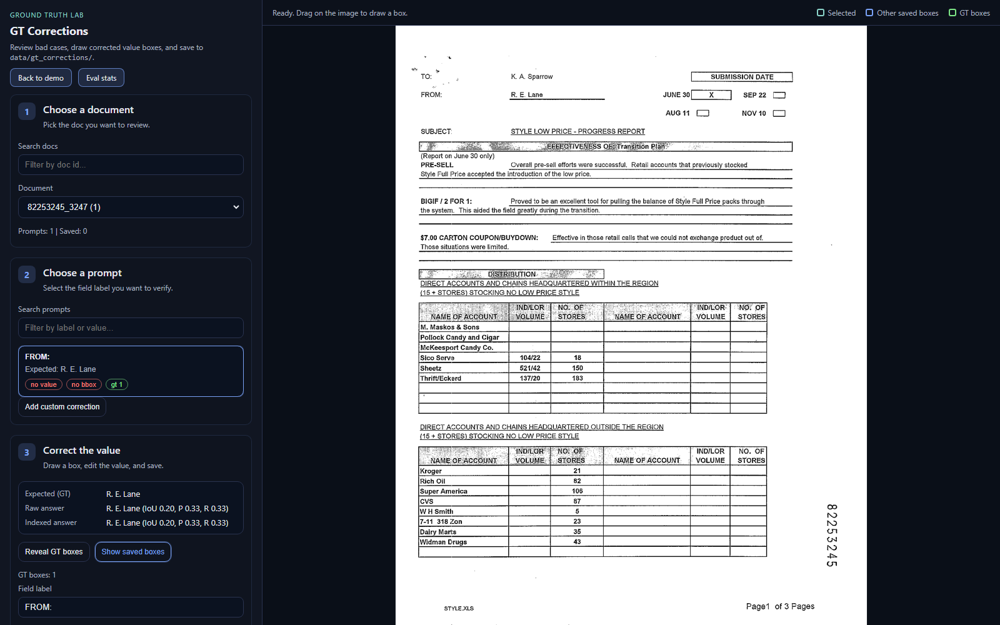
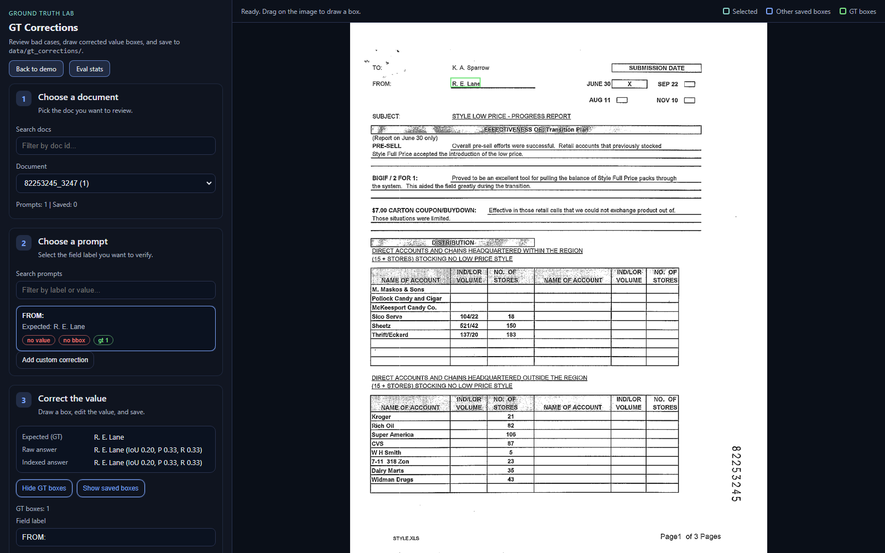

# GT Corrections User Guide

This guide walks through the lightweight GT relabeling page.
It is designed to help you review bad cases quickly, reveal GT boxes, and save corrected values.

## User stories

- As a reviewer, I want a clear step-by-step flow so I know what to do next.
- As a reviewer, I want to reveal GT boxes with one click to verify the ground truth.
- As a relabeler, I want to draw a box, edit the value, and save without leaving the page.
- As a relabeler, I want to see which prompts are missing a value or box.

## Open the tool

Start the demo server and open:
`/gt-review.html`

Example:
`http://127.0.0.1:8004/gt-review.html`

## Step 1 - Choose a document

Use the search box to filter doc ids, then pick a document from the dropdown.
The meta line shows how many prompts and saved corrections exist.

## Step 2 - Choose a prompt

Select a prompt card to focus on a single field label.
The chips show whether a value and bbox are already present and whether GT boxes are available.

## Step 3 - Reveal GT boxes

Click "Reveal GT boxes" to overlay the FUNSD ground-truth boxes for the selected prompt.
Use this to verify if the GT is correct or needs correction.

## Step 4 - Draw the corrected box

Drag on the document to create a bounding box for the correct value.
The selected box is teal; other saved boxes are blue.

## Step 5 - Save

Enter or update the value, optionally add notes, and click "Save corrections".
The JSON file is written under:
`data/gt_corrections/funsd/<doc_id>.json`

## Tips

- Use "Use expected / raw / indexed" for quick value fills.
- Toggle "Show saved boxes" if you only want to see the selected item.
- If no GT boxes appear, the label may not exist in FUNSD annotations for that doc.
