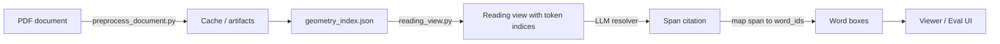
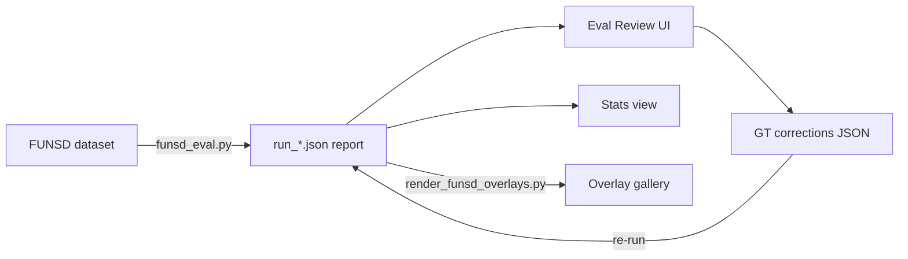

# Overview

This repo captures a document highlighting pipeline that converts unstructured documents into:
- cached, reproducible preprocessing artifacts, and
- geometry-grounded highlight outputs suitable for downstream rendering.

The design is intentionally preprocessing-first: expensive or fragile steps (parsing, OCR, geometry extraction)
happen once per document/config and are cached. Downstream logic operates on stable artifacts rather than
re-parsing the source file.

## High-level flow

## Core outcomes

1. Chunked text + coarse groundings (optional provider-backed)
   - Produces normalized chunks (text windows) with page/bbox groundings.
2. Fine geometry
   - Extracts word/line bounding boxes from the PDF text layer.
   - Optionally falls back to OCR when the text layer is missing or insufficient.
   - Vision rails are preferred when credentials are present.
3. Geometry index
   - Rearranges per-chunk geometry into a page-centric structure with stable `word_id`s and reading order.
4. LLM-indexed reading view
   - Renders the geometry index into a line-aware reading view with stable global token indices.
5. Span citation mapping
   - The LLM returns a short answer plus a cited source span.
   - Citations are `{ start_token, end_token, start_text, end_text, substr }`.
   - We validate and (optionally) snap spans using the guard tokens, then map spans -> `word_ids` -> geometry.
6. Raw + fuzzy resolver (two-pass)
   - First pass asks for raw span + raw extra context.
   - If mapping is ambiguous, a second pass uses a cheaper indexed resolver to return token indices.
7. Deterministic fallback
   - When the LLM is unavailable or span validation fails, a simple deterministic matcher can still resolve some citations.

## Evaluation loop (overview)

## Major components and code

Core pipeline
- Phase 1 preprocessing: `scripts/preprocess_document.py`
- Fine geometry extraction: `scripts/fine_geometry.py`
- Geometry index builder: `scripts/build_geometry_index.py`
- Reading view assembly: `scripts/reading_view.py`

Resolvers
- Indexed resolver: `scripts/llm_resolve_span.py`
- Raw + fuzzy two-pass resolver: `scripts/two_pass_resolve_span.py`
- Deterministic fallback: `scripts/resolve_highlight.py`

Demo + eval
- Local demo server: `scripts/demo_server.py`
- FUNSD evaluator: `scripts/funsd_eval.py`
- Overlay renderer: `scripts/render_funsd_overlays.py`

## Repository organization

- `scripts/` - pipeline code (Phase 1 + Phase 2)
- `docs/` - narrative + reference documentation
- `cache/` - generated artifacts keyed by `doc_hash` (not tracked)
- `logs/` - structured JSONL logs (not tracked)
- `demo-app/` - local interactive demo (fixed PDF + question input + Apryse viewer)
