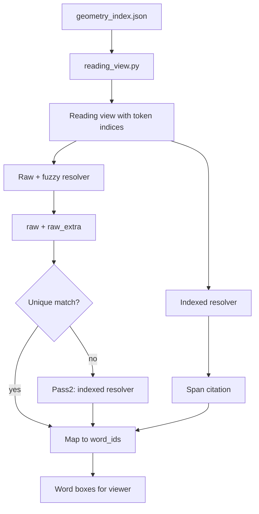
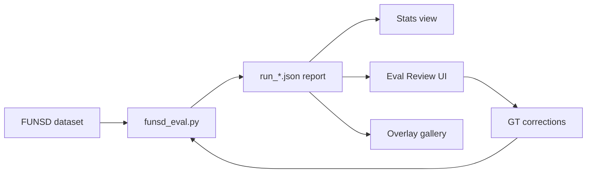

# Pipeline

The pipeline is split into two phases:

## Phase 1: Preprocess (artifact generation)

Goal: produce stable artifacts under `cache/<doc_hash>/` that can be reused across runs.

Inputs:
- source document (PDF)
- configuration flags (OCR enabled, provider parsing enabled, etc.)

Artifacts (typical):
- `ade_raw.json` / `ade_chunks.json` (if provider parsing enabled)
- `fine_geometry.json` (word + line bounding boxes keyed by chunk)
- `sentence_index.json` (sentence offsets keyed by chunk)
- `geometry_index.json` (optional derived index for fast resolver access)

Notes:
- `doc_hash` is computed from file bytes + a config signature so toggling OCR/providers creates a new cache key.
- Rails are required for highlights: always build a Geometry Index.
- Vision rails are the primary method when credentials are present; set VISION_RAILS_PRIMARY=0 to allow fallback.
- Tesseract OCR is the fallback for sparse/no text layer when fallback is allowed.

### Phase 1 flow (data + artifacts)

```mermaid
flowchart TB
  A[PDF document] --> B[preprocess_document.py]
  B --> C[fine_geometry.py]
  B --> D[sentence_indexer.py]
  C --> E[fine_geometry.json]
  D --> F[sentence_index.json]
  E --> G[build_geometry_index.py]
  F --> G
  G --> H[geometry_index.json]
  B --> I[ade_adapter.py (optional)]
  I --> J[ade_raw.json / ade_chunks.json]
```

Key code
- Preprocess entrypoint: `scripts/preprocess_document.py`
- Fine geometry extraction: `scripts/fine_geometry.py`
- Sentence index: `scripts/sentence_indexer.py`
- Geometry index builder: `scripts/build_geometry_index.py`
- Optional provider chunks: `scripts/ade_adapter.py`

## Phase 2: Resolve (highlight mapping)

Goal: map a question (or citation) to concrete geometry.

Inputs:
- `doc_hash` (to load Phase 1 artifacts)
- a query (LLM-first) or a citation substring (fallback)

> **Evaluation note:** the current approach can be token-heavy because it annotates every word token in the reading view. We will validate cost/accuracy on small samples before scaling full dataset runs. See `docs/next-steps.md`.

Outputs:
- a highlight object (or a canonical JSON file) with:
  - context polygons (coarse)
  - answer polygons (fine, word-level)
  - offsets/spans for auditing/debugging

LLM-first (token-indexed reading view):
- Build a full-document, line-aware reading view from `geometry_index.json`.
- Every word token is annotated with a stable global token index: `[<token_idx>:<word_id>]TokenText`.
- The LLM returns a short answer plus a source snippet, along with a single contiguous citation span using:
  - `start_token` / `end_token` (inclusive), plus
  - `start_text` / `end_text` guard tokens, plus
  - `substr` (verbatim span text).
- Tool-calling JSON is enforced for structured outputs.
- We validate and (optionally) snap spans using guard tokens, then map spans -> `word_ids` -> geometry.

Raw + fuzzy (two-pass):
- Pass 1 asks for `raw` and `raw_extra` (verbatim span + context).
- We fuzzy-match `raw` into the reading view.
- If there is no exact unique match, pass 2 sends the best match window with word indices to a cheaper model to return token indices.

Deterministic fallback:
- When the LLM is unavailable (no key) or returns invalid spans, fall back to exact substring matching on line text and map to a contiguous token window when possible.

### Phase 2 flow (resolvers)



Key code
- Reading view assembly: `scripts/reading_view.py`
- Indexed resolver: `scripts/llm_resolve_span.py`
- Raw + fuzzy resolver: `scripts/two_pass_resolve_span.py`
- Deterministic fallback: `scripts/resolve_highlight.py`

## Next experiment: iterative evaluation

See `docs/next-steps.md` for an evaluation plan that starts with small samples, verifies end-to-end reporting, then scales. The plan includes A/B comparison between indexed and raw+fuzzy methods.

### Evaluation flow (FUNSD)



Key code
- FUNSD evaluator: `scripts/funsd_eval.py`
- Overlay renderer: `scripts/render_funsd_overlays.py`
